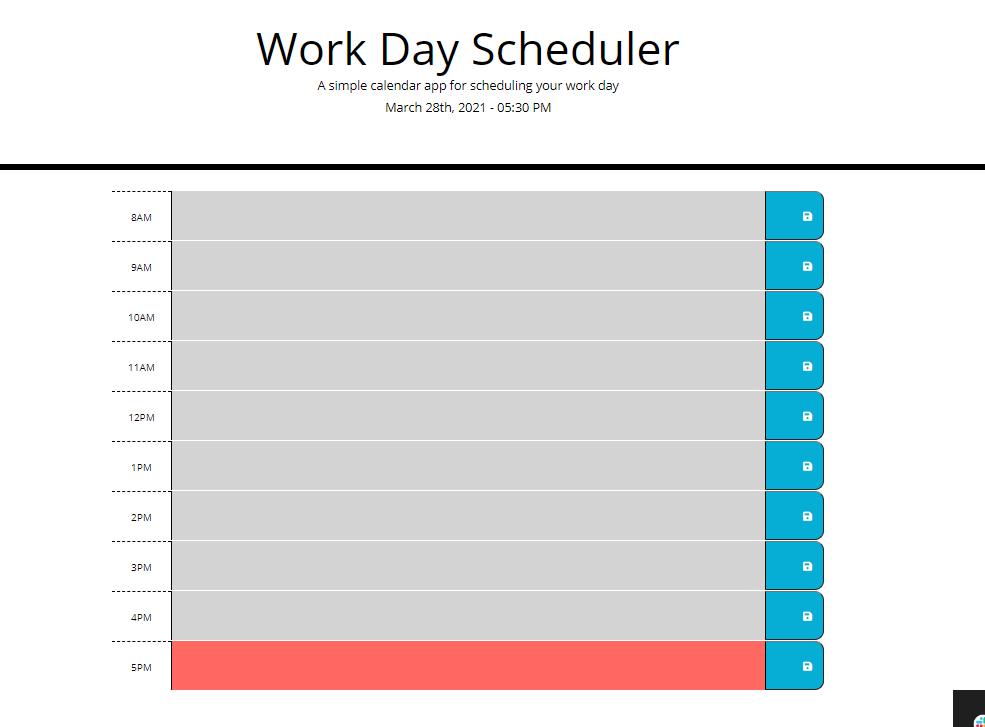

# Work-day-planner

## Description
A simple application that allows user to save task for each hour of working day. Task are saved on local storage and task are color coded based on time past, present and up coming. 

## Build used 
* HTML
* CSS
* jQuery
* Bootstrap
* JavaScript
* Moment.js

[Checkout deployed my application here!](https://chaitalizn.github.io/work-day-planner/)

## Screen capture 

## Contribution
intractive features by Chaitali Patel
